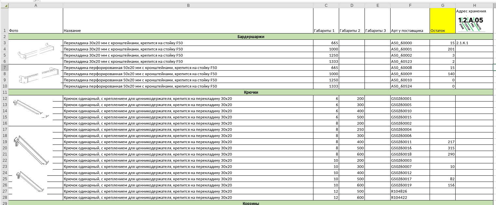
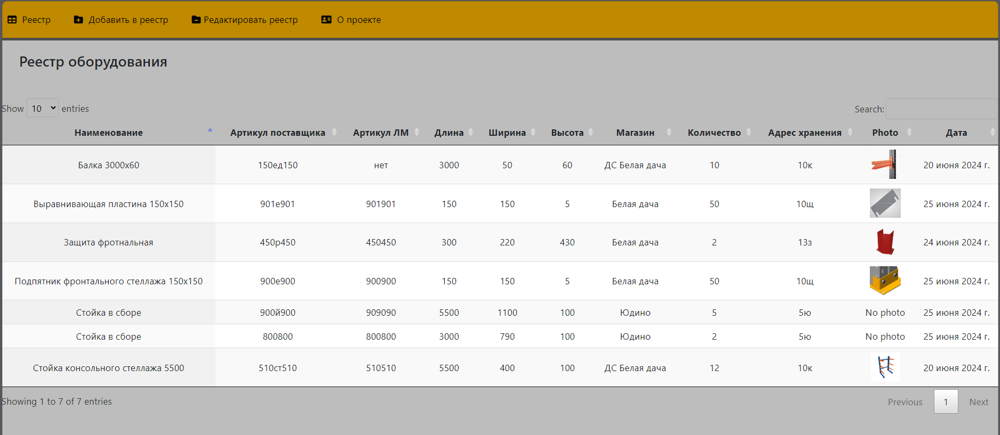
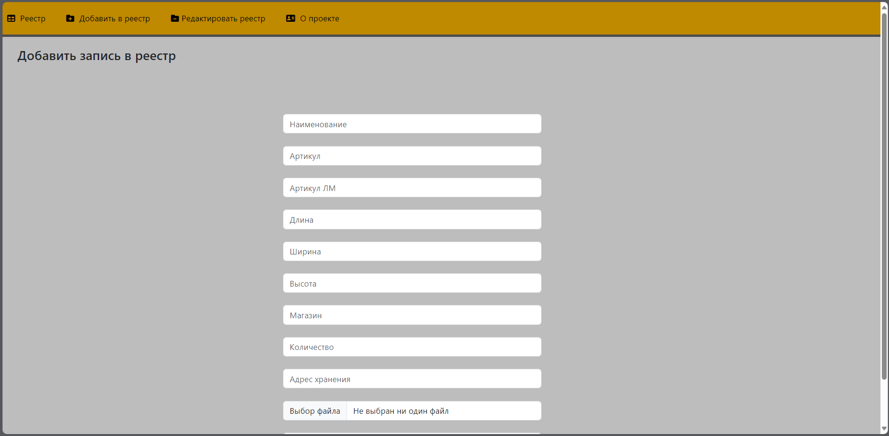
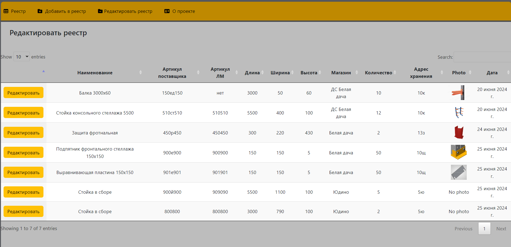
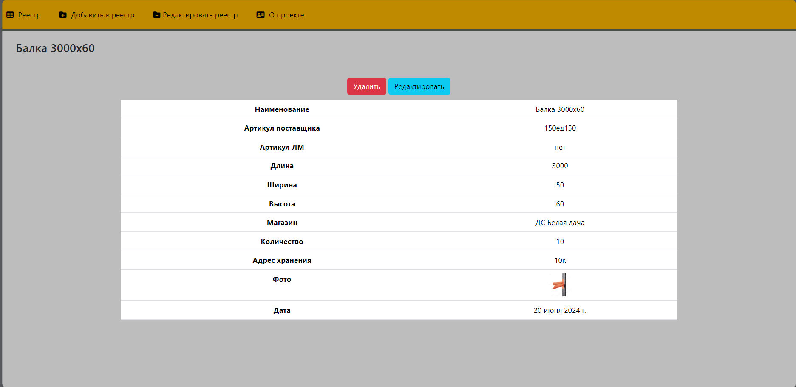

# Реестр оборудoвания

Реальный инструмент для работы. 
Реестр обрудования изначально был реализован на excel одном из магазинов для учета и хранения обордуования.
Со временем встала задача сделать инструмент многопользовательским с раздачей прав
на редактирование супер пользователям, для просмотра всем остальным. 
Размещение на корпоративном портале, испоьзование с любого устройства.

### Реестр в эксель 
 

Изначально был в облачной версии эксель, 
перекочевал с __google__ на __microsoft__, дальше на **yandex**  

### Новый реестр 
База данных на  __liteSQL+Python+Django__  представляет собой 4 вкладки.  
 **Реестр** - по сути таблица с данными 

**"Добавить в реестр"** - форма для заведения данных в таблицу

**"Редактировать реестр"** - форма для редактирования, после клика по редактированию детальный просмотр с формой для редактирования или удаления записи реестра.

## Инструкции по запуску
#### на MAC
- Клонируем репозиторий
- в папке проекта устанавливаем джанго 

> **pip install django**
  

> **python3 manage.py runserver**
 

#### на WINDOWS
- Необходимо включить сетевое окружение
- Для этого в переходим в папку проекта и устанавливаем
> **python -m venv venv**
 

> **.\venv\Scripts\activate**
 

> **pip install django**
 

> **python -m django --version**
 

> **python manage.py runserver**

### Справочные материалы

- https://www.youtube.com/watch?v=OYeqcxaYUbQ&list=PLDyJYA6aTY1nZ9fSGcsK4wqeu-xaJksQQ&index=5

> pip install django
 

> django-admin startproject nameProject
 

> python3 manage.py runserver 
 

> python3 manage.py startapp nameApp
  

- from django.http import HttpResponse в views используем как заглушку для проверки работы страниц, после render для отображения шаблонов
- Для отражения разных стилей подключим к проекту https://getbootstrap.com/ https://www.bootstrapcdn.com/
- официальная документация по джанго https://docs.djangoproject.com/en/5.0/howto/static-files/
- иконки для сайта https://fontawesome.com/, для работы нужно подключить в файле html в данном случае layout
- для настройки Datatables  официальная документация + видео 
- https://datatables.net/
- https://www.youtube.com/watch?v=6vVnP02bkQc&t=18s
- https://skillbox.ru/media/code/yazyk-razmetki-markdown-shpargalka-po-sintaksisu-s-primerami/#stk-6

#### Цвета  бренда
- #BF8900 темножелтый
- #fcc404 ярко желтый
- #7f795f серый
- #845d04 коричневый
- #242c2c темно серый
- #f0ecd8 молочный

- Комментарии в коде html <!--    -->